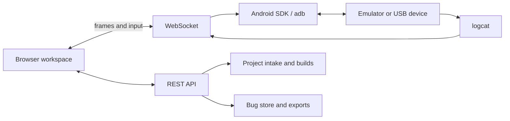

<div align="center">

# Device Lab

**Run, inspect, and document native mobile applications from one local browser workspace.**


</div>


## Why Device Lab exists

Native testing usually means switching between Android Studio, an emulator, `adb`, logcat, build output, screenshots, and a bug tracker. Device Lab brings those activities together: interact with the app, watch logs, detect crashes, and file a structured defect with evidence already attached.

## Core capabilities

| Capability | What it does |
| --- | --- |
| Live device view | Streams Android emulator or device frames into the browser and maps taps, swipes, text, and navigation keys back to the device |
| Project intake | Opens a local project, clones a GitHub repository, or installs a raw APK |
| Build and deploy | Detects Android/React Native/Flutter-style project shapes, runs the project build, locates the APK, installs it, and launches it |
| Live logcat | Streams, filters, pauses, and highlights device logs |
| Crash detection | Detects fatal exception and ANR patterns without requiring an app SDK |
| Evidence-rich bugs | Captures severity, area, repro steps, screenshot, recent logs, device details, package, and version |
| Export | Produces Markdown, CSV, JSON, or a ZIP with reports and screenshots |
| iOS lane | Embeds a legitimate cloud-hosted iOS simulator workflow and can generate a macOS GitHub Actions build definition |

## Screenshots

| Bug report with evidence | Live logcat |
| --- | --- |
|  |  |


## Quick start

### Prerequisites

- Node.js 18 or newer
- Android SDK with `adb`, emulator, build tools, and at least one AVD
- JDK 17 for Gradle builds
- Git for repository intake

```bash
git clone https://github.com/athompson83/device-lab.git
cd device-lab
npm install
npm start
```

Open `http://localhost:4830`, select an AVD, and start the emulator.

The repository includes `testapp/probe.apk`, a small smoke-test application with taps, text input, a toast, and a deliberate crash path. Use it to verify installation, input, logcat, crash detection, bug filing, and export before testing another project.

## Architecture



The frontend is intentionally plain browser JavaScript with no build step. The Node server binds to port `4830`; Android integration is wrapped in `lib/android.js`, project handling in `lib/projects.js`, and evidence/export logic in `lib/bugs.js`.

## REST and WebSocket surface

| Endpoint | Purpose |
| --- | --- |
| `GET /api/device` | AVDs, connected devices, boot state, and current app |
| `POST /api/device/start` | Start an emulator |
| `POST /api/projects` | Add a local path, GitHub repository, or APK |
| `POST /api/projects/:id/build` | Build, install, and launch |
| `POST /api/projects/:id/install` | Install an existing APK |
| `POST /api/bugs` | File a bug with automatic evidence |
| `GET /api/bugs/export` | Export Markdown, CSV, JSON, or ZIP |

`/ws` carries PNG frames plus log, crash, build, and input events.

## iOS boundary

iOS Simulator requires Apple hardware. Device Lab therefore supports legitimate remote/cloud simulator and macOS build paths; it does not claim to emulate modern iOS locally on Windows. A first-party remote Mac lane remains a roadmap item.

## Security

> [!WARNING]
> The server is localhost-only and has no authentication. Do not expose port `4830` to an untrusted network.

- Build only repositories you trust; running a project’s Gradle wrapper executes its build logic.
- Appetize settings are stored under gitignored local data and should never be committed.
- Runtime bug data and screenshots live under `data/`; treat them as potentially sensitive.
- Review exported reports before sharing because logs and screenshots may contain credentials or personal data.

## Roadmap

Work is tracked through [repository issues](https://github.com/athompson83/device-lab/issues), including macOS/Linux host support, higher-FPS streaming, physical-device polish, Flutter builds, a remote Mac lane, and session recording.

## License

[MIT](LICENSE)