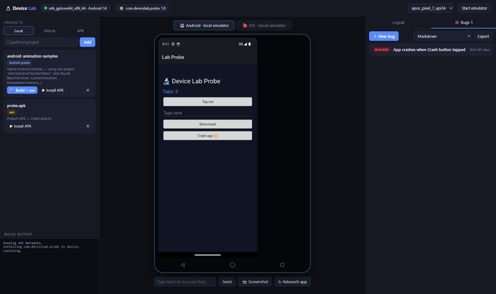
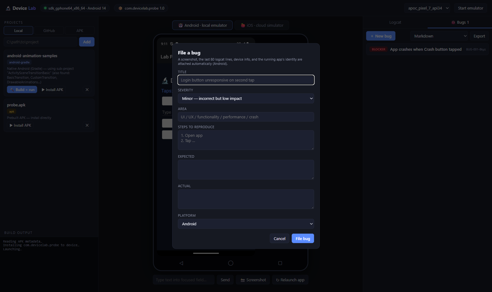
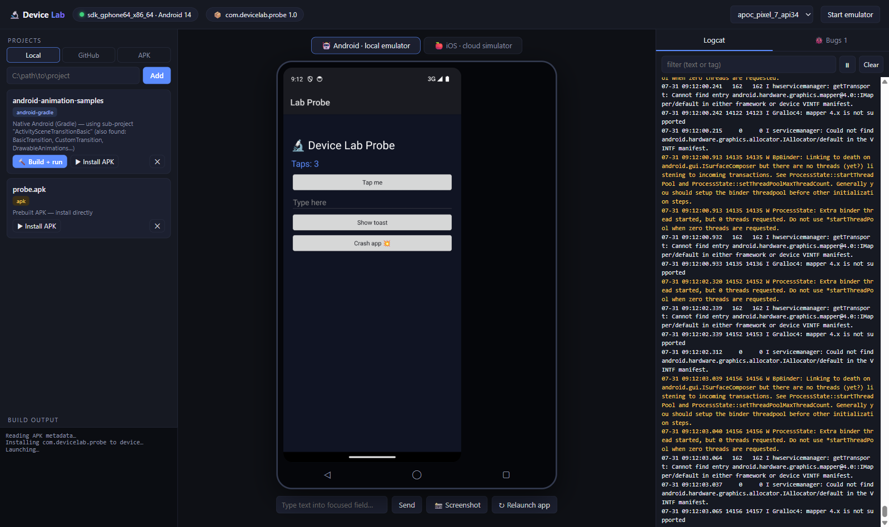
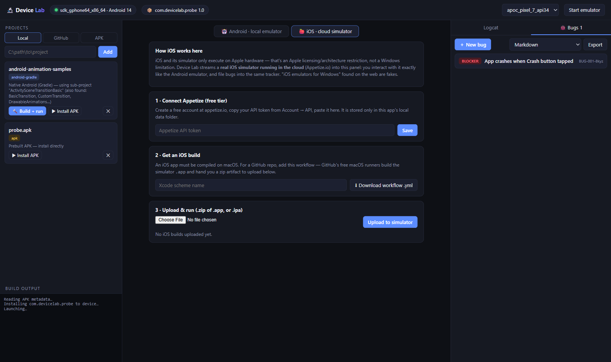
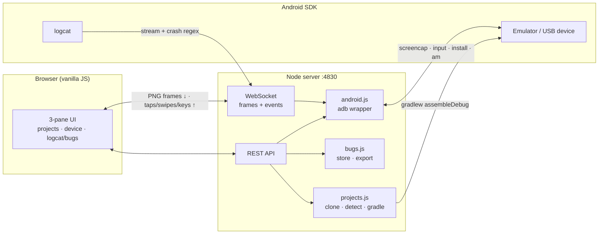

# 🔬 Device Lab

**Run and test native mobile apps on a PC.** A local web app that streams a real
Android emulator into your browser, pulls projects from anywhere (local folder,
GitHub repo, or raw APK), builds and deploys them, and files structured bug
reports with evidence — screenshot, logcat, device info — captured automatically.


-lightgrey.svg)



## Why

Testing a native app normally means juggling Android Studio, an emulator window,
`adb` in a terminal, logcat in another, and a bug tracker in a browser tab.
Device Lab folds all of that into one screen: **interact with the app on the
left, watch logcat on the right, and when something breaks, one click files a
bug with the evidence already attached.**

## Features

| | |
|---|---|
| 📱 **Live emulator in the browser** | Screen streamed over WebSocket. Click = tap, drag = swipe, type into fields, Back/Home/Recents keys. No emulator window juggling. |
| 📂 **Projects from anywhere** | Local folder, `git clone` of any GitHub repo, or a prebuilt APK. Auto-detects Android-Gradle, React Native, Flutter, iOS-only, and APKs — including sub-projects inside monorepos/samples repos. |
| 🔨 **One-click build & deploy** | `gradlew assembleDebug` with live streamed output → APK located → installed → launched. APK metadata read with `aapt2` (no hardcoded package names). |
| 📜 **Logcat, tamed** | Live stream with level colouring, text filtering, and pause. |
| 💥 **Crash detection** | `FATAL EXCEPTION` / ANR patterns in logcat pop a "File bug?" toast, pre-filled with the crash excerpt. Works for *any* app — no SDK integration required. |
| 🐞 **Bug tracker with automatic evidence** | Severity, area, steps, expected/actual — plus auto-attached screenshot, last 200 logcat lines, device model/OS/resolution, and app package/version. |
| 📤 **Export** | Markdown report, CSV, JSON, or a ZIP containing all three plus every screenshot. |
| 🍎 **iOS lane** | Streams a **real cloud iOS simulator** (Appetize.io free tier) into the same UI, with a generated GitHub Actions workflow that builds your simulator `.app` on GitHub's free macOS runners. |

## Screenshots

| Bug filing with auto-evidence | Live logcat |
|---|---|
|  |  |



## Quick start

**Prerequisites**

- **Node.js ≥ 18**
- **Android SDK** with `platform-tools` (adb), `emulator`, `build-tools`, and at
  least one AVD created (install [Android Studio](https://developer.android.com/studio)
  or the command-line tools). Set `ANDROID_HOME` if the SDK isn't in the default
  location (`%LOCALAPPDATA%\Android\Sdk`).
- **JDK 17** (for Gradle builds; set `JAVA_HOME`)
- **git** (for the GitHub project source)

**Run**

```bash
git clone https://github.com/athompson83/device-lab.git
cd device-lab
npm install
npm start
```

Open **http://localhost:4830**, pick your AVD in the header, hit **Start
emulator**, and give it a minute to boot.

**Smoke test** — the repo ships a 16 KB probe app
([`testapp/probe.apk`](testapp/)) built directly with `aapt2 + d8 + apksigner`
(no Gradle — see [`testapp/build.sh`](testapp/build.sh)). Add it via the **APK**
tab and hit *Install APK*: it has a tap counter, a text field, a toast button,
and a 💥 button that deliberately crashes so you can watch crash detection fire.

## How it works



- **Screen streaming** is `adb exec-out screencap -p` broadcast to WebSocket
  clients (~1.4 fps). Deliberately dependency-free; a scrcpy-based high-FPS
  streamer is on the roadmap.
- **Input** arrives as normalized 0–1 coordinates and is mapped to the device
  resolution (`adb shell wm size`), so it works on any screen size.
- **Crash detection** is a regex over a 400-line logcat ring buffer — meaning it
  works on any installed app with zero SDK integration.
- **Bug storage** is plain JSON on disk (`data/bugs.json` + PNG screenshots) —
  no database, trivially portable, and the export formats are generated from it.

## iOS on a PC — the honest story

iOS and its Simulator execute **only on Apple hardware**. That's Apple
licensing plus closed-source frameworks, not a Windows limitation — tools like
appium-ios-simulator, AXe, and the various simctl/idb MCP servers are remote
*controllers* for Apple's Simulator and all require a Mac. Projects that tried
to reimplement iOS on Windows (ipasim/WinObjC) are abandoned; touchHLE runs
only 2008-era iPhone OS apps.

Device Lab therefore gives you the two legitimate paths from a PC:

1. **Cloud simulator, streamed** — the iOS tab embeds a real simulator running
   on Appetize.io's Macs (free tier available). Upload a simulator-built
   `.zip`/`.ipa` and interact with it next to the same bug tracker.
2. **Cloud build** — the iOS tab generates a GitHub Actions workflow that
   compiles your repo's simulator `.app` on GitHub's free macOS runners, giving
   you an artifact to upload.

Have a spare Mac on your network? The roadmap includes driving it directly over
SSH (`simctl` + screenshot streaming) — same UX, no third-party service.

## REST API (for scripting)

| Endpoint | Purpose |
|---|---|
| `GET /api/device` | AVDs, connected devices, boot state, current app |
| `POST /api/device/start` `{avd}` | boot an emulator |
| `POST /api/projects` `{source: local\|github, location}` | add/clone a project |
| `POST /api/projects/:id/build` | gradle build → install → launch (progress over WS) |
| `POST /api/projects/:id/install` | install existing/prebuilt APK |
| `POST /api/bugs` | file a bug (evidence auto-attached) |
| `GET /api/bugs/export?format=md\|csv\|json\|zip` | export the report |

WebSocket at `/ws`: binary messages are PNG screen frames; JSON messages carry
`logcat`, `crash`, `build`, `buildDone`, `buildError` events; send
`{t:'tap'|'swipe'|'key'|'text', …}` to inject input.

## Project layout

```
server.js          Express + WebSocket server (port 4830)
lib/android.js     SDK integration: adb, emulator, screencap, input, logcat
lib/projects.js    intake (local/GitHub/APK), kind detection, gradle builds
lib/bugs.js        bug store + Markdown/CSV/JSON export
public/            UI — vanilla JS, zero build step
testapp/           probe app source + no-Gradle build script + prebuilt APK
data/              runtime state (gitignored): bugs, projects, settings, screenshots
workspace/         cloned repos (gitignored)
```

## Security notes

- The server binds to `localhost` with no authentication — **don't expose port
  4830** beyond your machine.
- Your Appetize API token is stored in `data/settings.json` (gitignored) and
  only ever sent to `api.appetize.io`.
- "Build + run" executes a project's own `gradlew` — the standard Android trust
  model, but be deliberate about which repos you build, same as opening them in
  Android Studio.

## Roadmap

- [ ] macOS/Linux host support (paths are currently Windows-flavored)
- [ ] scrcpy-based high-FPS screen streaming
- [ ] Physical device support polish (USB devices already appear via adb)
- [ ] Flutter build lane (`flutter build apk`) when the Flutter SDK is present
- [ ] Remote Mac lane: drive `simctl` over SSH for a first-party iOS simulator
- [ ] Session recording — replay taps as repro steps attached to bugs

## Contributing

Issues and PRs welcome. Keep it dependency-light (the whole frontend is
vanilla JS on purpose), and run the probe-app smoke test before submitting:
install `testapp/probe.apk`, tap around, crash it, file a bug, export.

## License

[MIT](LICENSE)
